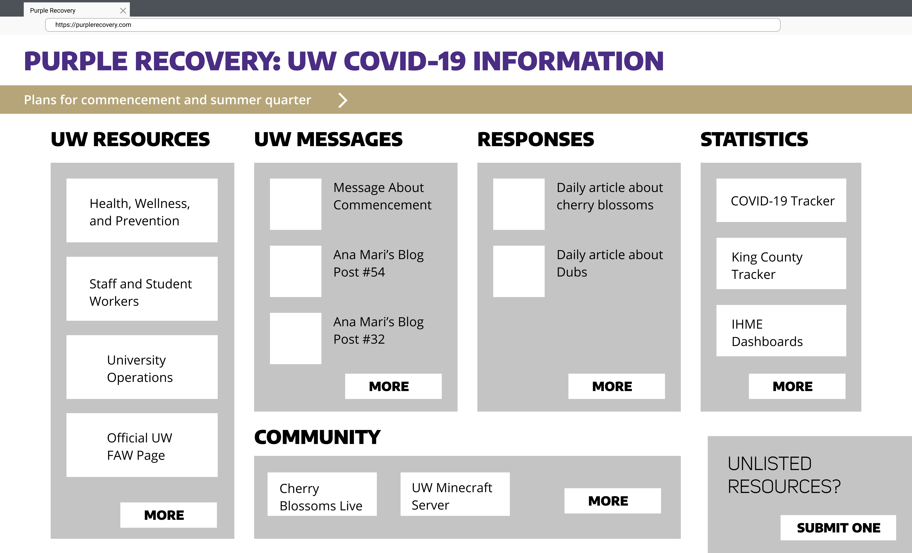
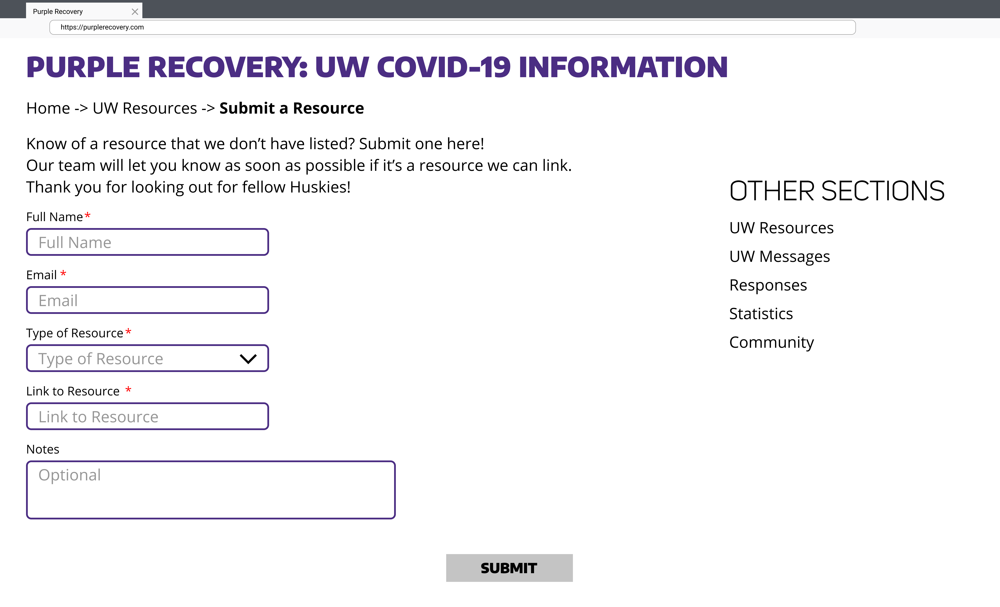

# Homework 2: Designing a Solution
**Purple Recovery**

## Problem

Right now, the University of Washington’s official statistics, resources, and other responses are scattered (via department, college, unit, etc). After conducting internal user research, our organization found it difficult to navigate the FAQs and resources meant to make UW Seattle student lives easier during this time of uncertainty. This poses problems to students as they might need to do a lot of searching and jumping around different webpages, emails, and social media posts. 

The [UW's “COVID-19 Landing Page”](https://www.washington.edu/coronavirus/) currently aims to provide a one-stop, although it is not as comprehensive as it could be. This seems to be missing: university buildings’ hours, resources that are staying open, lack of RSO information, and where to turn for academic support. 

### Literary Research

According to researchers at [Cambridge University](https://www.cambridge.org/core/journals/disaster-medicine-and-public-health-preparedness/article/do-pandemic-preparedness-planning-systems-ignore-critical-community-and-locallevel-operational-challenges/D472C569D002A2525F941B537D1E9064), “pandemic preparedness planning systems ignore the critical community and local-level operational challenges”. It is clear that the University of Washington, its students, and its local community are directly affected by a swirl of information that became immediately available, but not necessarily easy to navigate in a single space. The current information system does a disservice in the lack of additional resources for community members who are still in the area as well during this pandemic. 

### Heuristic Evaluation

The UW COVID-19 page is quite text-heavy and scroll-reliant, and the interface for the FAQs is in a list view, making browsing a challenge. To get a clearer view of this, we performed a heuristic evaluation of the following metrics, adapted from [Nielsen and Molich’s 10 UI Design Heuristics](https://www.interaction-design.org/literature/article/heuristic-evaluation-how-to-conduct-a-heuristic-evaluation):

**Visibility of system status** 

* While a fairly simple system, there is an italicized subtitle under the main header that displays the last date and time that the page was updated. 

**Match between system and the real world**
 
* The “system” is a web page with lots of text, divided into a traditional two-column layout: 
	* Left column has most of the information 
		* A top text-based nav, each one leading to a different FAQ section (three out of the five hyperlinked options do NOT match FAQ title, e.g. “What to do if you feel sick” leads to “Health, wellness, and prevention”, but does match the first question in the section
		* Paragraphs
		* Expandable FAQs
	* Right column is more narrow
		* “Spring Quarter Resources” + hyperlinked button
		* Messages and Updates (list view of hyperlinks and dates to various “official statements”)
		* Testing Results + hyperlinked button
		* Resources + hyperlinked button

**User control and freedom**

* Backward steps are only possible via scrolling back to specific section

**Consistency and standards**

* Webpage has graphic elements and terminology that are maintained across similar platforms/i.e. UW branding is very clear

**Recognition rather than recall; flexibility and efficiency of use**

* Navigating the page relies a lot on user’s cognitive load
* Very reliant on scrolling; no clear markers/indicators on how to jump between sections, aside from expandable individual FAQs
* FAQ section has 11 sections; the biggest section has 17 questions (all in a list view)
* Only has a top text-based nav for FAQs (seem to be quick links) and a more comprehensive FAQs table of contents; both are non-sticky/disappear after one-page scroll

**Aesthetic and minimalist design**

* While no “unnecessary” information, interfaces comes across as cluttered because there is a lot of information

## Solution

We envision a section-based dashboard for our solution.

	
Upon opening the portal, users are greeted with UW COVID-19 Information organized into categories in a card-view: UW Resources (Official UW Resources), UW Messages (Official UW Messages, Responses (Student/staff pieces, opinion or otherwise), Statistics (Data sources), and Community (Resources and activities meant to  help others connect during self isolation). Each section will have a more button bringing the user to a dedicated page for that specific section. (These more butons will be more semantically named later in our design process.) Further, there will also be a top banner displaying the most recently posted UW official message. 

When clicking the “More” buttons, the user will be taken to that section’s own page, which would have more detailed links. There is then also a side pseudo-navigation just in case the user needs to view another section.

Users can also submit resources that may not be available on the page. It consolidates the many virtual events that are happening in the UW community. These events are usually on facebook or segregated from each department. In these isolating times, it would be beneficial for the community to gather together even if it is on a virtual plane.

